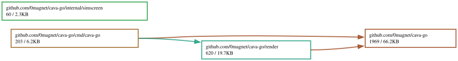

# cava-go

A Go port of [karlstav/cava](https://github.com/karlstav/cava) — Console-based
Audio Visualizer for ALSA, by Karl Stavestrand — built on
[go-dsp](https://github.com/0magnet/go-dsp) for the transform and
[tcell](https://github.com/gdamore/tcell) for the drawing.

No cgo, and no FFTW. The original links against a GPL FFTW, which is the reason
its own README has a paragraph about licensing; here the transform is a Go one
and the whole thing stays MIT.

```
                        ▃▃
                        ██
                        ██
                        ██          ▃▃
                        ██          ██
                        ██          ██
               ██       ██          ██
               ██    ██ ██ ██       ██       ██
               ██    ██ ██ ██    ▆▆ ██ ▆▆    ██
         ▇▇ ▅▅ ██ ▅▅ ██ ██ ██    ██ ██ ██ ▁▁ ██ ▁▁
      ▂▂ ██ ██ ██ ██ ██ ██ ██ ▅▅ ██ ██ ██ ██ ██ ██    ██
▂▂ ▄▄ ██ ██ ██ ██ ██ ██ ██ ██ ██ ██ ██ ██ ██ ██ ██ ▇▇ ██ ▇▇
```

Stereo, so the left channel runs outwards to the left and the right channel
outwards to the right, with the bass of both meeting in the middle.

## What is implemented, and what is not

The part of cava that is worth porting is the engine — `cavacore` — and that is
here in full, arithmetic for arithmetic. What is not here is the audio
backends, all of which need a C library:

| | |
|---|---|
| **input: fifo** | implemented |
| **input: stdin** | implemented — not one of cava's, but a pipe is a pipe |
| input: alsa, pulse, pipewire, portaudio, jack, sndio, oss, coreaudio, shmem, winscap | **not implemented** — each is a cgo binding to a system audio library |
| **output: noncurses** | implemented, on tcell |
| **output: raw** | implemented, binary and ascii |
| output: ncurses, sdl, sdl_glsl, noritake | **not implemented** — ncurses, SDL, OpenGL, a VFD panel |

Asking for one of the missing methods is an error naming the library it would
have needed, not a silent fallback to something else:

```
$ cava-go -input pulse
cava-go: input method "pulse" needs libpulse and is not available in this pure-Go port; use 'fifo' or 'stdin'
```

That is deliberate. A visualizer that quietly draws the wrong source looks
exactly like one that works.

Of the engine, everything is ported: the two transform sizes, the logarithmic
band distribution, the hard-coded equalizer, the integral and gravity filters,
autosens, the monstercat and waves filters, the user equalizer, the eight
partial-block glyphs, both orientations that a terminal font can render, and
the color options including both gradients. Left out along with SDL are the
`horizontal` and `vertical` split orientations, the waveform mode, and shaders.

## Install

```
go install github.com/0magnet/cava-go/cmd/cava-go@latest
```

## Feeding it

There is no autodetection, because there is nothing to detect. Something has to
write raw PCM where cava-go can read it.

**mpd** has a fifo output. Add this to `mpd.conf` and restart it:

```
audio_output { type "fifo" name "cava" path "/tmp/mpd.fifo" format "44100:16:2" }
```

```
cava-go -source /tmp/mpd.fifo
```

**Anything ffmpeg can decode**, straight down a pipe:

```
ffmpeg -loglevel quiet -i track.flac -f s16le -ar 44100 -ac 2 - | cava-go -input stdin
```

**A fifo you make yourself**, which is how to get any player that can write a
file to drive it:

```
mkfifo /tmp/cava.fifo
ffmpeg -loglevel quiet -i track.flac -f s16le -ar 44100 -ac 2 /tmp/cava.fifo &
cava-go -source /tmp/cava.fifo
```

A file or a pipe hands over its contents as fast as the disk allows, which is
nothing like the speed the audio plays at. cava-go reads at the sample rate
regardless, so a whole track does not go past in three frames; there is no need
for ffmpeg's `-re` or any other throttle. A source that is already live — a
player writing a fifo — is unaffected, because the wait is then always zero.

The fifo is reopened whenever its writer goes away, so restarting the player
does not mean restarting the visualizer. While nothing is writing, the display
falls away rather than freezing on its last frame.

**Sample format** is `-rate`, `-channels`, `-bits` and `-float`, defaulting to
44100 Hz, two channels of signed 16-bit little endian — what everything above
produces:

```
cava-go -source /tmp/cava.fifo -rate 48000 -channels 2 -bits 32 -float
```

## Keys

| | |
|---|---|
| `q`, `Escape`, `Ctrl-C` | quit |
| up, down | sensitivity |
| left, right | bar width |
| `r` | redraw |

## Configuration

cava's own INI file, read from `$XDG_CONFIG_HOME/cava/config` or
`~/.config/cava/config`, or from `-p somewhere/else`. An existing cava config
loads as it is: keys that belong to a feature this port does not have are
reported and skipped rather than rejected.

```ini
[general]
framerate = 60
bars = 0                  # 0 fills the terminal
bar_width = 2
bar_spacing = 1
autosens = 1
sensitivity = 100
lower_cutoff_freq = 50
higher_cutoff_freq = 8000
max_height = 100
scaling = linear          # or decibel
center_align = 1
sleep_timer = 0

[input]
method = fifo             # or stdin
source = /tmp/mpd.fifo
sample_rate = 44100
sample_bits = 16
channels = 2

[output]
method = noncurses        # or raw
orientation = bottom      # or top
channels = stereo         # or mono
mono_option = average     # or left, right
reverse = 0
xaxis = none              # or frequency
show_idle_bar_heads = 1
raw_target = /dev/stdout
data_format = binary      # or ascii
bit_format = 16bit
ascii_max_range = 1000
bar_delimiter = 59
frame_delimiter = 10

[color]
foreground = default
background = default
gradient = 0
gradient_color_1 = '#59cc33'
gradient_color_2 = '#cc3333'
horizontal_gradient = 0
blend_direction = 'up'

[smoothing]
monstercat = 0
waves = 0
noise_reduction = 77

[eq]
1 = 1
2 = 1.5
3 = 0.5
```

Any of it can be set on the command line instead, with cava's `-o`:

```
cava-go -o smoothing.monstercat=1.5 -o color.gradient=1 -o general.bars=40
```

An unknown key is an error rather than a shrug. A misspelled setting that does
nothing is worse to debug than one that refuses to start.

## Raw output

`-raw` writes bar heights instead of drawing them, which is how cava is used as
a source for something else — a status bar, an LED strip, a shader.

```
$ ffmpeg -loglevel quiet -i track.flac -f s16le -ar 44100 -ac 2 - | \
    cava-go -input stdin -raw -bars 16 -o output.channels=mono -o output.data_format=ascii
0;0;0;0;0;0;909;10;0;0;0;0;0;0;0;0;
```

Binary output is one byte per bar at `bit_format = 8bit` and two little-endian
bytes at `16bit`.

## What "faithful" means here

The engine is transcribed rather than reimplemented, down to the arithmetic
that looks like a mistake and is not. Two examples, both of which move a bar
boundary by a whole FFT bin if they are tidied up:

**The cut-off frequencies are computed in 32-bit float.** The original declares
them `float` and C keeps them there through the divisions and the powers. Doing
it in `float64` gives slightly different numbers, and those numbers are
truncated to integer bin indices, so slightly different is a different bin.

**`rate / FFTbassbufferSize` is an integer division.** At 44100 Hz over 8192
points the minimum bandwidth is 5 Hz and not 5.38, because both operands are
`int` in C.

The evidence that this matters is that cava ships a blueprint. Its
`cavacore_test.c` runs a 200 Hz tone in one channel and 2000 Hz in the other
for three hundred frames and checks the final bar heights against a hard-coded
table to within 2%. That table, and the signal that produces it, are in
`cava_test.go` unchanged, and this port reproduces it. It is the one test here
that checks this code against the original rather than against itself, and it
is what says the band layout, windowing, equalizer, transform, smoothing and
sensitivity all agree.

## Differences from the original

**The reader delivers at the sample rate.** cava assumes a live source, because
every backend it has is one: the engine estimates its frame rate from how many
samples arrive per call, the smoothing constants are scaled by that estimate,
and the drawing loop takes whatever has accumulated since the last frame. Hand
all of that a file and it is over in three frames. Here the reader waits, so a
file or a pipe plays at the speed it was recorded at and a source that is
already live is unaffected — the wait is then always zero.

**A frame with no samples does not poison the frame rate estimate.** cava
divides by `new_samples / channels`, an integer division, so a call carrying
fewer samples than there are channels divides by zero and leaves the estimate
infinite for the rest of the run. Here such a call is not counted.

**Mono input with stereo output is refused rather than read past the end of a
buffer.** cava fills only half its output array in that case and then reads all
of it. Here the output falls back to mono, which is the only thing it could
have meant.

**24-bit input is decoded as 24-bit.** cava reads a full 32-bit integer at a
three-byte stride, so each sample carries a byte of the next one in its low
bits. Inaudible, since the value is divided down anyway, but this
sign-extends the three bytes instead.

**Binary raw output is explicitly little endian.** cava writes the machine's
own byte order. This differs only on hardware cava is not built for.

**The whole drawing area is rewritten each frame.** cava's "noncurses" output
is so named because it tracks the previous frame and emits cursor moves for
just the cells that changed. tcell already does exactly that underneath, so
doing it again above would only make its diff worse.

## Portability

No cgo, so it runs where Go runs. Nothing in the engine, the filters, the
shaper or the config touches the host at all — only `input.go` opens anything —
so the same code can be driven from a browser with samples from anywhere.
`SetSingleThreaded` turns off the transform's worker pool, which is what to do
under js/wasm.

## License

MIT, as the original is. Copyright (c) 2015 Karl Stavestrand, who wrote cava.
See [LICENSE](LICENSE).

## Dependency Graph

Made with [goda](https://github.com/loov/goda):

```
go run github.com/loov/goda@latest graph github.com/0magnet/cava-go/... | dot -Tsvg -o docs/cava-go-goda-graph.svg
```



## Lines of Code

Made with [gocloc](https://github.com/hhatto/gocloc) (excludes `vendor/`, `node_modules/`, `.git/`):

```
gocloc --not-match-d='(vendor|node_modules|\.git)' .
```

```
-------------------------------------------------------------------------------
Language                     files          blank        comment           code
-------------------------------------------------------------------------------
Go                              20            458            975           4095
Markdown                         1             67              0            245
YAML                             1              0              7             98
JSON                             1              0              0              8
-------------------------------------------------------------------------------
TOTAL                           23            525            982           4446
-------------------------------------------------------------------------------
```
